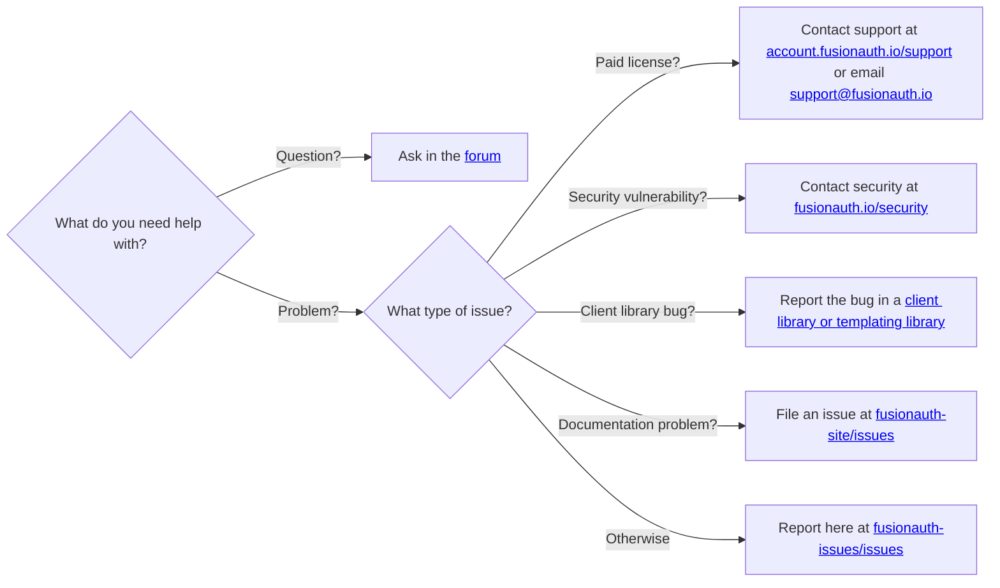

# FusionAuth Issues

This repository provides a place for FusionAuth users to report suspected issues and feature requests.

## Guidelines

* Be respectful and polite. See our [community guidelines](https://fusionauth.io/community/forum/topic/1000/code-of-conduct) for specific guidance.
* Be constructive and informative when reporting your issue to assist debugging.
* Do not request progress updates or delivery dates in issue comments. If you have a paid plan or a support contract, please make those inquiries through [support](https://account.fusionauth.io/account/support/).

## Client library bugs

If you encounter a bug in one of our client libraries, open an issue directly on the corresponding project:

* [angular-client](https://github.com/FusionAuth/fusionauth-angular-client/issues)
* [csharp-client](https://github.com/FusionAuth/fusionauth-csharp-client/issues)
* [dart-client](https://github.com/FusionAuth/fusionauth-dart-client/issues)
* [go-client](https://github.com/FusionAuth/go-client/issues)
* [java-client](https://github.com/FusionAuth/fusionauth-java-client/issues)
* [javascript-client](https://github.com/FusionAuth/fusionauth-javascript-client/issues)
* [netcore-client](https://github.com/FusionAuth/fusionauth-netcore-client/issues)
* [node-client](https://github.com/FusionAuth/fusionauth-node-client/issues)
* [php-client](https://github.com/FusionAuth/fusionauth-php-client/issues)
* [ruby-client](https://github.com/FusionAuth/fusionauth-ruby-client/issues)
* [swift-client](https://github.com/FusionAuth/fusionauth-swift-client/issues)
* [typescript-client](https://github.com/FusionAuth/fusionauth-typescript-client/issues)

Our client libraries are built using a templating system. For typos in comments or syntax issues, report the issue in the [client templates](https://github.com/FusionAuth/fusionauth-client-builder) or [JSON DSL](https://github.com/FusionAuth/fusionauth-client-builder/tree/master/src/main/api) repositories.
